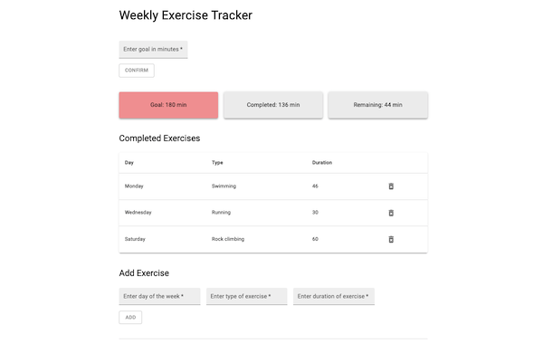

# Exercise Tracker

## About

A simple app to track weekly exercise sessions. Users can enter exercises they have completed and see whether or not they have reached their weekly goal.



## Technologies

React, React Hooks, React Context, Material UI.

## Installation Instructions

```
$ git clone https://github.com/HannaEb/exercise-tracker.git
$ cd exercise-tracker
$ npm install
$ npm start
```

## Author

HannaEb
